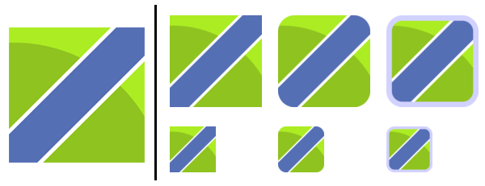

# 方便快捷地生成iOS和Android应用图标

## 使用方法

- 把用于生成图标的原始图片文件与`genicon.py`放置于同一目录下，运行脚本`python ./genicon.py`，即可生成图标文件，输出到`./outputs`目录下。
- 支持自定义传参图片路径，`python ./genicon.py <图片路径>`，输出到图片所在目录下的`./outputs`目录下。
- 支持自定义传参输出目录，`python ./genicon.py <图片路径> <输出目录>`。

此外，你还可以运行脚本`python ./genicon.py help`或者`python ./genicon.py h`来查看使用方法。

生成图标时，可以为图标加圆角或加单色的边框。以下是一个示例，左侧是原始图片，右侧是生成的图标。




## 运行需要

- Python 3.x
- Pillow: `pip install pillow`

## 自定义配置

根据需要设置`path`和`size`，注意两个列表中的元素应一一对应
如iOS的路径和图标尺寸可分别写成：

```python
path_Android = ['mipmap-xxxhdpi/ic_launcher', 'mipmap-xxhdpi/ic_launcher', 'mipmap-xhdpi/ic_launcher', 'mipmap-hdpi/ic_launcher', 'mipmap-mdpi/ic_launcher']
size_Android = [192, 144, 96, 72, 48]
```

除路径与图标尺寸之外，还有以下参数：

| 参数                     | 说明                        |
| ---------------------- | ------------------------- |
| `auto_overwrite`       | 布尔值 生成图标时是否覆盖已有图标         |
| `gen_for_iOS`          | 布尔值 是否按照iOS的路径和尺寸生成图标     |
| `gen_for_Android`      | 布尔值 是否按照Android的路径和尺寸生成图标 |
| `need_frame`           | 布尔值 是否为图标加边框              |
| `frame_width_ratio`    | 浮点值 边框的宽度与图标尺寸的比值         |
| `frame_radius_ratio`   | 浮点值 边框的外侧半径与图标尺寸的比值       |
| `frame_color`          | 由三个整数组成的元组 边框颜色的RGB值      |
| `need_rounded`         | 布尔值 是否为图标加圆角              |
| `rounded_radius_ratio` | 浮点值 圆角的半径与图标尺寸的比值         |


---


# Fast and easy way to generate icons for iOS and Android apps

## Usage

- Put the original image you use to generate icons and the script `genicon.py` in the same directory, run the script(`python ./genicon.py`) and then you will get the icons generated in the `./outputs` directory. 
- Support custom input image path, run `python ./genicon.py <input image path>`, and then output to the `./outputs` directory under the directory where the input image is located.
- Support custom outputs directory, run `python ./genicon.py <input image path> <outputs directory>`.

In addition, you can run the script(`python ./genicon.py help` or `python ./genicon.py h`) to help you to learn how to use this.

When generating you can add round corners or a simple frame for the them. The following figure demonstrates an example: on the left side is the original image while on the right side are the generated ones.


## Requirement

- Python 3.x
- Pillow: `pip install pillow`

## Customize

Set both `path` and `size` as what you need, make sure the elements in the two lists are one-to-one correspondened. For example,  the paths and icon sizes for Android can be set as:

```python
path_Android = ['mipmap-xxxhdpi/ic_launcher', 'mipmap-xxhdpi/ic_launcher', 'mipmap-xhdpi/ic_launcher', 'mipmap-hdpi/ic_launcher', 'mipmap-mdpi/ic_launcher']
size_Android = [192, 144, 96, 72, 48]
```

Additionally, there are some more useful parameters:

| Parameter              | Description                              |
| ---------------------- | ---------------------------------------- |
| `auto_overwrite`       | Boolean: True for overwriting the icons existing with same name |
| `gen_for_iOS`          | Boolean: True for generating icons for iOS |
| `gen_for_Android`      | Boolean: True for generating icons for Android |
| `need_frame`           | Boolean: True for add frame for icons    |
| `frame_width_ratio`    | Float: the ratio frame width to icon size |
| `frame_radius_ratio`   | Float: the ratio frame outter radius to icon size |
| `frame_color`          | Tuple in which are 3 integers indicating the RGB value of frame color |
| `need_rounded`         | Boolean: True for round corner for icons |
| `rounded_radius_ratio` | Float: the ratio corner radius to icon size |

